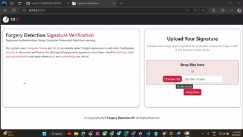

# Forgery Detection - Signature Verification System


This project is a **Signature Forgery Detection System** built using **Django** and **TensorFlow/Keras**, which leverages **transfer learning** with pre-trained CNN models including **ResNet50**, **VGG16**, **VGG19**, and a **custom CNN model**. The aim is to classify whether a given signature is *genuine* or *forged*.

---

## 📌 Project Objectives

- Detect forged signatures using deep learning
- Use transfer learning with pre-trained models for efficient training
- Train multiple models for comparison and accuracy benchmarking
- Serve predictions through a Django web interface 

---


## 🧠 Model Architectures

### 1. 🔧 Custom CNN Model

A standard CNN with multiple convolution and pooling layers followed by dense layers.

- Input size: `150x150`
- Layers: Conv2D → MaxPooling → Dense
- Optimizer: Adam (`lr=0.0001`)
- Loss: Binary Crossentropy
- Metrics: Accuracy
- Epochs: `100` (with early stopping)

---

### 2. 🧠 ResNet50 (Transfer Learning)

- Pre-trained on ImageNet (`include_top=False`)
- Input size: `64x64`
- Pooling: `avg`
- Added Layers: Flatten → Dense(512 → 435 → 365 → 1)
- Trainable Layers: All frozen
- Optimizer: Adam
- Epochs: `100` (early stopping with patience 30)

---

### 3. 🧠 VGG16 (Transfer Learning)

- Pre-trained on ImageNet (`include_top=False`)
- Input size: `64x64`
- Pooling: `avg`
- Added Layers: Flatten → Dense(512 → 450 → 260 → 1)
- Trainable Layers: All frozen
- Optimizer: Adam
- Epochs: `100` (early stopping with patience 30)

---

### 4. 🧠 VGG19 (Transfer Learning)

- Pre-trained on ImageNet (`include_top=False`)
- Input size: `64x64`
- Pooling: `avg`
- Added Layers: Flatten → Dense(512 → 455 → 250 → 1)
- Trainable Layers: All frozen
- Optimizer: Adam
- Epochs: `100` (early stopping with patience 30)

---

## 🧰 Technologies & Libraries Used

This project combines deep learning with web development to deliver a full-stack signature forgery detection system.

### 🔧 Backend
- **Django** — Web framework to handle routing, views, form submissions, file storage, and templating.
- **Python** — Core programming language for backend logic and model execution.

### 📄 Templating & Styling
- **Django Template Language (DTL)** — For dynamic HTML rendering with logic blocks, URL routing, and static file linking.
- **Bootstrap 5** — For responsive layout, modern UI components, grid system, and modals.
- **Bootstrap Icons** — Used to visually enhance success/failure results.
- **Custom CSS** — For additional design and theming.

### 🤖 Machine Learning / Deep Learning
- **TensorFlow / Keras** — To train, load, and infer from deep learning models:
  - Custom Sequential CNN Model
  - ResNet50 (Transfer Learning)
  - VGG16 (Transfer Learning)
  - VGG19 (Transfer Learning)
- **NumPy / OpenCV** *(optional)* — For image preprocessing.

### 🌐 Web Functionality
- Signature image upload via Django form.
- Real-time model prediction for 4 different CNN architectures.
- Display of:
  - Confidence scores per model
  - Averaged result and final verification decision
  - Signature preview for the uploaded image
  - Responsive and mobile-friendly layout.

---


## 📂 Dataset

Dataset used: [Signature Verification Dataset by robinreni](https://www.kaggle.com/datasets/robinreni/signature-verification-dataset)

Downloaded using `kagglehub`:

```python
import kagglehub

path = kagglehub.dataset_download("robinreni/signature-verification-dataset")
print("Path to dataset files:", path)
```

## 🔗 Download Pre-trained Models

To get started quickly, you can download the pre-trained `.h5` models from the following Google Drive links:

| **Model Name** | **Architecture**     | **Download Link** |
|----------------|----------------------|-------------------|
| Custom CNN     | Custom-built CNN     | [Download](https://drive.google.com/drive/folders/15Dh7d9g2zpmRf7nnKMXb0toMeJWt38QW?usp=sharing) |
| ResNet50       | Transfer Learning    | [Download](https://drive.google.com/drive/folders/15Dh7d9g2zpmRf7nnKMXb0toMeJWt38QW?usp=sharing) |
| VGG16          | Transfer Learning    | [Download](https://drive.google.com/drive/folders/15Dh7d9g2zpmRf7nnKMXb0toMeJWt38QW?usp=sharing) |
| VGG19          | Transfer Learning    | [Download](https://drive.google.com/drive/folders/15Dh7d9g2zpmRf7nnKMXb0toMeJWt38QW?usp=sharing) |


## 🚀 Getting Started
- Ensure you have installed Docker.


### 📦 Clone the Repository
```bash
git clone https://github.com/sanu0711/Forgery-Detection-Signature-Verification.git
```
### 🐳 Navigate to the project directory
```bash
cd Forgery-Detection-Signature-Verification
```

### 🛠️ Build and Run the Application
This command will build the Docker image and start the Django server inside a container.
-  Place the downloaded .h5 files inside the trained_models/ directory before running the app.
```bash
docker-compose up --build
```
### 🌐 Access the Web App
```
http://localhost:8000/
```
Here, you can upload signature images and get real-time forgery predictions from 4 different deep learning models


## 🎥 Demo



---


